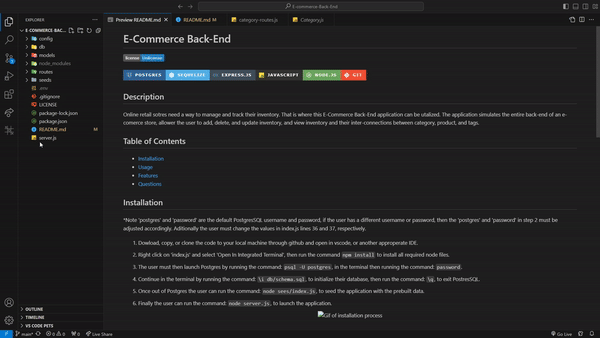
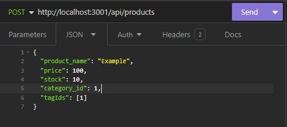
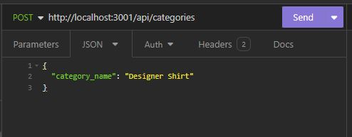
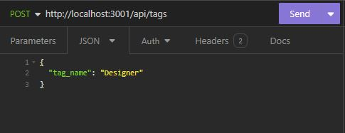

# E-Commerce Back-End

  [](http://unlicense.org/)

  

## Description

Online retail stores need a way to manage and track their inventory, this is where the E-Commerce Back-End application can be utilized. The application simulates just the back-end of an e-comerce store, allowing the user to add, delete, update, and view inventory and the inventories inter-connections between category, product, and tags.

## Table of Contents

- [Installation](#installation)
- [Usage](#usage)
- [Features](#features)
- [Questions](#questions)

## Installation
*Note 'postgres' and 'password' are the default PostgresSQL username and password, if the user has a different username or password, then the 'postgres' and 'password' in step 3 must be adjusted accordingly. Additionally, the user must change the values in ``.env`` file, lines 2 and 3, respectively.

1. Download, copy, or clone the code to your local machine through GitHub and open in VSCode, or another appropriate IDE. 

2. Right click on 'server.js' and select 'Open In Integrated Terminal', then run the command ```npm install``` to install all required node files. 

3. The user must then launch Postgres by running the command: ```psql -U postgres```, in the terminal then running the command: ```password```. 

4. Continue in the terminal by running the command: ```\i db/schema.sql```, to initialize their database, then run the command: ```\q```, to exit PostresSQL.

5. Once out of Postgres the user can run the command: ```node seed/index.js```, to seed the application with the prebuilt data.

6. Finally, the user can run the command: ```node server.js```, to launch the application.

<p align="center">
    


## Usage

Video demonstrating usage:  https://www.youtube.com/watch?v=lIgMrvm-vfo

Using an application like Insomnia that can perform RESTful API requests, the user can perform requests to the following routes: ```/api/products```, ```/api/categories```, ```/api/tags```, respectively. The user can then perform the following: a GET request to view everything in the selected route, a GET request to select a specific item of the selected route via the id, i.e ```/api/products/3```, a POST request to add an object in the selected route, a PUT request to edit an object in the selected route, and a DELETE request to delete an object from the selected route.

POST AND PUT requests need to follow the following json parameters:

  

## Credits

Base code provided by UCI Virtual Bootcamp

## License

This application is covered under Unlicense license.

## Features

This application boasts the integration of PostgressSQL databases into JavaScript, through the use of Sequalize. Additionally this application features express.js to build a local server to perform a variety of POST, GET, PUT and DELETE requests.

## Questions

Any questions please reach-out at: samuelfullerca@gmail.com

To view additional applications developed by myself, checkout my GitHub profile: 
<a href="https://github.com/SamuelFullerCA"> SamuelFullerCA </a>